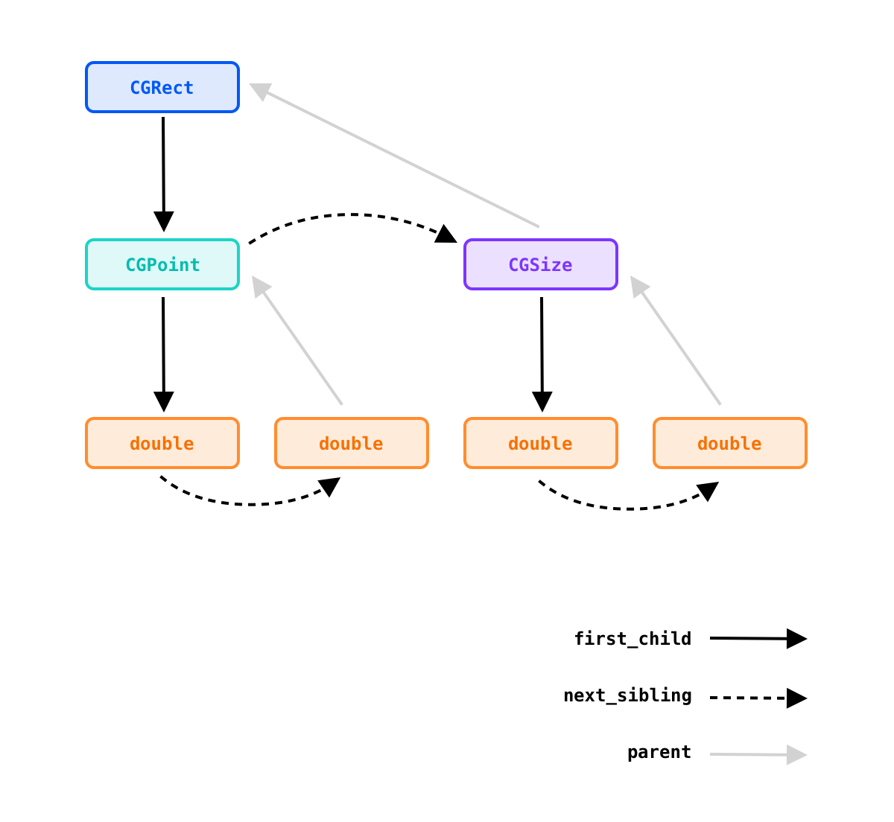

# Objective-C Encoding Parser

This library is a simple parser for Objective-C [type encoding](https://developer.apple.com/library/archive/documentation/Cocoa/Conceptual/ObjCRuntimeGuide/Articles/ocrtTypeEncodings.html) with a focus on cross-platform.

See [parser.h](./parser.h) for the provided APIs and [run-test.c](./run-test.c) to learn how this library works in action.

## Features

* Simple and intuitive APIs, ready for use without reading any documents.
* Zero-dependency and platform-agnostic, tested in macOS, Linux and Windows, easy to integrate with your various analysis facilities.
* Full support of the type encoding syntax (including struct, union), and able to get the related information of the type (like name, size and alignment).
* Error tolerance for ill-formed encoding strings, the library parses inputs in its best effort.
* Built-in dump function to print the human-readable string describing the type.

## Building

### Make

```
git clone https://github.com/unixzii/objc-encodingparser.git
cd objc-encodingparser
make
```

This will generate both the static library `libocep.a` and a `run-test` program.

### Xcode / Visual Studio

The project (solution) both contains two targets: `libocep` and `RunTest`. Once build is succeeded, you can retrieve the products from your IDE's build directory.

## Type Node Explained

`ocep_type_node_t` is the core structure of this library, you parse an encoding string and get the result with that type. It's like an n-ary tree and each node has a parent pointer, a child pointer and a sibling pointer. An example is shown as the below figure:



You can use `ocep_type_node_traverse` function to visit all the children (include itself) of a given node in a DFS-fashion traverse.

## Limitations

* Bit fields are currently not supported (since it's rare in Objective-C code), submit an issue if you see this important.
* Type size is now calculated in the compact layout (eg. `"{?=c^vc}"` will get a size of 16 while actually it's 24).

## License

This project is licensed under MIT license.